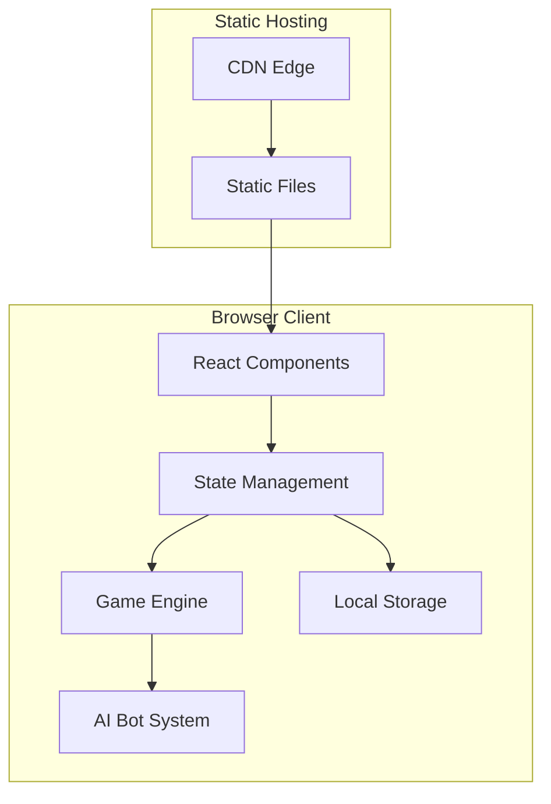
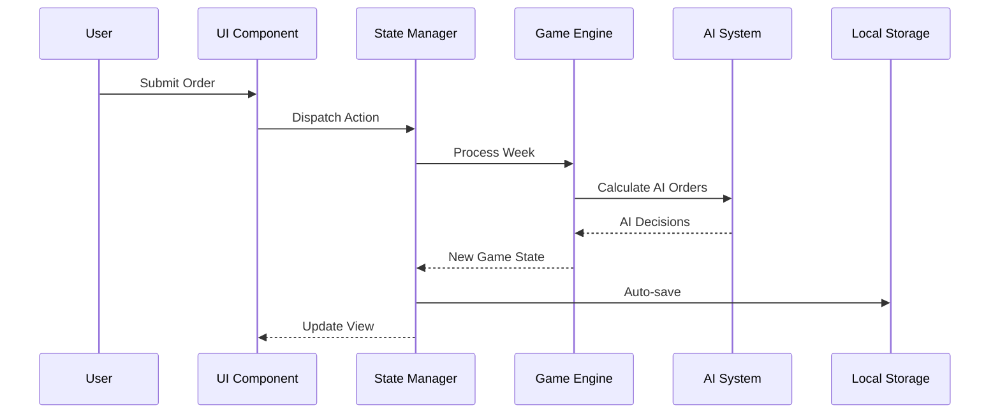

# Technical Architecture: Beer Game Supply Chain Simulation

## Executive Summary

### Project Overview
The Beer Game Supply Chain Simulation is a browser-based, single-player educational game that teaches supply chain management principles through interactive gameplay. This frontend-only application requires no backend infrastructure, utilizing browser capabilities for all game logic, state management, and data persistence.

### Key Architectural Decisions
- **Frontend-Only Architecture**: Eliminates backend complexity, reduces hosting costs, enables offline play
- **Next.js 14+ with App Router**: Modern React framework for optimal performance and developer experience
- **TypeScript**: Type safety ensures code reliability and maintainability
- **Local Storage Persistence**: Simple, reliable game state management without external dependencies
- **Component-Based Architecture**: Modular design enables parallel development and testing
- **Client-Side AI**: Embedded bot logic for single-player gameplay without server requirements

### System Component Overview
The application consists of four main architectural layers:
1. **Presentation Layer**: React components with Tailwind CSS styling
2. **Business Logic Layer**: Game engine, AI bot system, cost calculations
3. **State Management Layer**: React Context/Zustand for game state
4. **Persistence Layer**: Browser Local Storage for save/resume functionality

### Critical Technical Constraints and Assumptions
- Modern browser with JavaScript enabled (Chrome 100+, Firefox 100+, Safari 15+, Edge 100+)
- 5MB local storage quota sufficient for game data
- Client-side processing adequate for AI calculations
- No real-time multiplayer requirements
- Static hosting sufficient (Vercel, Netlify, GitHub Pages)

## For Frontend Engineers

### Component Architecture and State Management

#### Component Hierarchy
```
App
├── Layout
│   ├── Navigation
│   └── Footer
├── Pages
│   ├── LandingPage
│   │   ├── HeroSection
│   │   ├── HowToPlaySection
│   │   └── SupplyChainDiagram
│   ├── ConfigurationPage
│   │   ├── RoleSelector
│   │   ├── DurationSlider
│   │   └── GameSettings
│   ├── GameDashboard
│   │   ├── GameHeader (Week, Progress)
│   │   ├── SupplyChainVisualization
│   │   ├── InventoryPanel
│   │   ├── OrderPanel
│   │   ├── CostPanel
│   │   └── ChartsPanel
│   └── CompletionPage
│       ├── PerformanceSummary
│       ├── CostBreakdown
│       └── LearningsPanel
└── SharedComponents
    ├── Button
    ├── Card
    ├── Modal
    ├── Tooltip
    └── Charts (Line, Bar, Area)
```

#### State Management Architecture
```typescript
// Global State Structure
interface GameState {
  // Configuration
  config: {
    role: 'retailer' | 'wholesaler' | 'distributor' | 'manufacturer';
    duration: number; // 20-52 weeks
    difficulty: 'easy' | 'normal' | 'hard';
  };

  // Game Progress
  currentWeek: number;
  isGameActive: boolean;
  isPaused: boolean;

  // Supply Chain State
  positions: {
    retailer: PositionState;
    wholesaler: PositionState;
    distributor: PositionState;
    manufacturer: PositionState;
  };

  // Historical Data
  history: WeekData[];
}

interface PositionState {
  inventory: number;
  backorders: number;
  incomingOrders: number[];
  outgoingShipments: number[];
  costs: {
    holding: number;
    backorder: number;
    total: number;
  };
}
```

#### State Management Implementation
- Use **Zustand** for global game state management
- React Context for theme/UI preferences
- Local component state for form inputs and UI interactions
- Immer for immutable state updates

### API Integration Patterns and Error Handling

Since this is a frontend-only application, "API" refers to internal service layer patterns:

#### Service Layer Architecture
```typescript
// services/gameEngine.ts
class GameEngine {
  initializeGame(config: GameConfig): GameState
  processWeek(currentState: GameState, playerOrder: number): GameState
  calculateCosts(position: PositionState): CostBreakdown
  checkGameCompletion(state: GameState): CompletionStatus
}

// services/aiBot.ts
class AIBotService {
  calculateOrder(position: PositionState, difficulty: Difficulty): number
  predictDemand(history: WeekData[]): number
  adjustStrategy(performance: PerformanceMetrics): void
}

// services/storage.ts
class StorageService {
  saveGame(state: GameState): Promise<void>
  loadGame(): Promise<GameState | null>
  clearGame(): Promise<void>
  exportData(format: 'json' | 'csv'): Blob
}
```

#### Error Handling Strategy
```typescript
// Error boundary for component crashes
class GameErrorBoundary extends React.Component {
  componentDidCatch(error: Error, errorInfo: ErrorInfo) {
    // Log to console
    // Display user-friendly error message
    // Offer game state recovery options
  }
}

// Service layer error handling
try {
  const newState = gameEngine.processWeek(currentState, order);
  setGameState(newState);
} catch (error) {
  if (error instanceof ValidationError) {
    showToast('Invalid order quantity', 'error');
  } else if (error instanceof StateError) {
    recoverFromCorruptedState();
  } else {
    logError(error);
    showErrorModal();
  }
}
```

### Routing and Navigation Architecture

#### Route Structure (Next.js App Router)
```
app/
├── layout.tsx                 # Root layout with providers
├── page.tsx                    # Landing page
├── game/
│   ├── layout.tsx             # Game layout wrapper
│   ├── configure/page.tsx     # Game configuration
│   ├── play/page.tsx          # Main game dashboard
│   └── complete/page.tsx      # Completion summary
├── tutorial/page.tsx          # Interactive tutorial
└── api/                       # Route handlers (if needed)
    └── export/route.ts        # Data export endpoint
```

#### Navigation Flow
1. Landing → Configuration (protected by validation)
2. Configuration → Game Dashboard (saves config to state)
3. Game Dashboard → Completion (triggered by week limit)
4. Any page → Resume Game (if saved state exists)

### Performance Optimization Strategies

#### Code Splitting and Lazy Loading
```typescript
// Lazy load heavy components
const ChartsPanel = lazy(() => import('./ChartsPanel'));
const TutorialMode = lazy(() => import('./TutorialMode'));

// Route-based code splitting (automatic with Next.js)
// Each page becomes a separate bundle
```

#### Rendering Optimization
```typescript
// Memoize expensive calculations
const bullwhipEffect = useMemo(() =>
  calculateBullwhipEffect(history), [history]);

// Prevent unnecessary re-renders
const OrderInput = memo(({ onSubmit }) => {
  // Component only re-renders when onSubmit changes
});

// Virtual scrolling for long data lists
<VirtualList
  items={history}
  renderItem={(week) => <WeekRow data={week} />}
/>
```

#### State Update Optimization
```typescript
// Batch state updates
flushSync(() => {
  updateInventory(newInventory);
  updateOrders(newOrders);
  updateCosts(newCosts);
});

// Debounce frequent updates
const debouncedSave = useDebouncedCallback(
  (state) => storageService.saveGame(state),
  1000
);
```

### Build and Development Setup Requirements

#### Development Environment
```json
// package.json
{
  "scripts": {
    "dev": "next dev",
    "build": "next build",
    "start": "next start",
    "lint": "eslint . --ext ts,tsx",
    "type-check": "tsc --noEmit",
    "test": "jest",
    "test:watch": "jest --watch",
    "storybook": "storybook dev -p 6006"
  },
  "dependencies": {
    "next": "^14.0.0",
    "react": "^18.2.0",
    "react-dom": "^18.2.0",
    "zustand": "^4.4.0",
    "recharts": "^2.8.0",
    "tailwindcss": "^3.3.0",
    "clsx": "^2.0.0"
  },
  "devDependencies": {
    "@types/react": "^18.2.0",
    "@types/node": "^20.0.0",
    "typescript": "^5.2.0",
    "eslint": "^8.50.0",
    "@testing-library/react": "^14.0.0",
    "jest": "^29.7.0"
  }
}
```

#### Environment Configuration
```typescript
// env.d.ts
declare namespace NodeJS {
  interface ProcessEnv {
    NEXT_PUBLIC_APP_URL: string;
    NEXT_PUBLIC_ENABLE_ANALYTICS: string;
    NEXT_PUBLIC_DEBUG_MODE: string;
  }
}
```

## For QA Engineers

### Testable Component Boundaries and Interfaces

#### Component Testing Strategy
```typescript
// Component contracts for testing
interface GameDashboardProps {
  initialState?: GameState;
  onOrderSubmit: (order: number) => void;
  onGameComplete: (summary: CompletionData) => void;
}

// Test boundaries
- Unit tests: Individual functions and utilities
- Component tests: Isolated component behavior
- Integration tests: Component interactions
- E2E tests: Full user journeys
```

### Data Validation Requirements and Edge Cases

#### Input Validation Matrix
| Input Field | Valid Range | Edge Cases | Error Handling |
|------------|-------------|------------|----------------|
| Order Quantity | 0-9999 | Negative, decimal, text | Show validation error |
| Game Duration | 20-52 | <20, >52, non-integer | Clamp to valid range |
| Role Selection | 4 options | No selection | Disable start button |
| Storage Quota | <5MB | Exceeded quota | Cleanup old data |

### Integration Points Requiring Testing

#### Critical Integration Tests
1. **State Persistence**
   - Save/load game state
   - Handle corrupted data
   - Storage quota limits

2. **AI Bot System**
   - Order calculation logic
   - Difficulty variations
   - Boundary conditions

3. **Chart Rendering**
   - Data updates
   - Performance with 52 weeks
   - Responsive resizing

### Performance Benchmarks and Quality Metrics

| Metric | Target | Measurement |
|--------|--------|-------------|
| Initial Load Time | <3s | Lighthouse |
| Time to Interactive | <3s | Web Vitals |
| Frame Rate (Charts) | 30+ FPS | Performance Monitor |
| Memory Usage | <100MB | Chrome DevTools |
| State Update Latency | <100ms | Custom metrics |

### Security Testing Considerations

#### Client-Side Security Checklist
- [ ] Input sanitization on all fields
- [ ] XSS prevention in dynamic content
- [ ] Local storage encryption for sensitive data
- [ ] Content Security Policy headers
- [ ] Dependency vulnerability scanning

## For Security Analysts

### Authentication Flow and Security Model

Since this is a frontend-only application without user accounts:

#### Session Management
```typescript
// Pseudonymous session tracking
interface Session {
  id: string; // UUID v4
  startedAt: Date;
  gamesPlayed: number;
  preferences: UserPreferences;
}

// No authentication required
// No personal data collected
// Analytics anonymized
```

#### Data Protection Strategy
```typescript
// Local storage encryption (optional for game state)
class SecureStorage {
  private encrypt(data: string): string {
    // Use SubtleCrypto API for client-side encryption
    return window.crypto.subtle.encrypt(/*...*/);
  }

  private decrypt(data: string): string {
    return window.crypto.subtle.decrypt(/*...*/);
  }
}
```

#### Security Headers Configuration
```typescript
// next.config.js
module.exports = {
  headers: async () => [
    {
      source: '/:path*',
      headers: [
        {
          key: 'Content-Security-Policy',
          value: "default-src 'self'; script-src 'self' 'unsafe-inline'; style-src 'self' 'unsafe-inline';"
        },
        {
          key: 'X-Frame-Options',
          value: 'DENY'
        },
        {
          key: 'X-Content-Type-Options',
          value: 'nosniff'
        }
      ]
    }
  ]
};
```

## System Architecture Diagrams

### High-Level Architecture


### Data Flow Architecture


## Implementation Priorities

### Phase 1: Core Foundation (Week 1)
1. Project setup with Next.js and TypeScript
2. Component architecture and routing
3. Basic state management structure
4. Landing page and configuration UI

### Phase 2: Game Engine (Week 2)
1. Game logic implementation
2. Supply chain flow simulation
3. Cost calculation engine
4. AI bot system

### Phase 3: Dashboard & Visualization (Week 3)
1. Game dashboard UI
2. Chart integration
3. Real-time state updates
4. Persistence layer

### Phase 4: Polish & Optimization (Week 4)
1. Performance optimization
2. Error handling
3. Tutorial mode
4. Testing suite

## Risk Mitigation Strategies

| Risk | Impact | Mitigation |
|------|--------|------------|
| Browser compatibility issues | High | Progressive enhancement, polyfills, extensive testing |
| Performance degradation with charts | Medium | Virtualization, debouncing, canvas rendering |
| Local storage limitations | Medium | Data compression, cleanup strategies, warning messages |
| Complex state management | High | Immutable updates, comprehensive testing, error boundaries |
| AI bot predictability | Low | Randomization factors, multiple strategies, difficulty levels |

## Technology Stack Summary

### Core Technologies
- **Framework**: Next.js 14+ (App Router)
- **Language**: TypeScript 5.2+
- **Styling**: Tailwind CSS 3.3+
- **State Management**: Zustand 4.4+
- **Charts**: Recharts 2.8+
- **Testing**: Jest + React Testing Library
- **Build Tool**: Next.js built-in Webpack
- **Deployment**: Vercel/Netlify

### Development Tools
- **Linting**: ESLint with TypeScript rules
- **Formatting**: Prettier
- **Git Hooks**: Husky + lint-staged
- **Component Development**: Storybook
- **Bundle Analysis**: @next/bundle-analyzer

This architecture provides a solid foundation for building the Beer Game Supply Chain Simulation as a performant, maintainable, and educational frontend-only application.